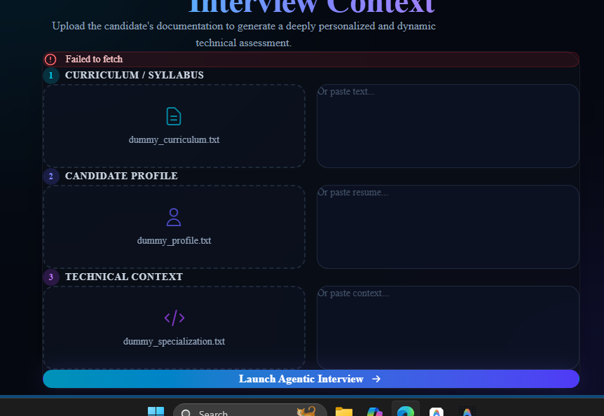
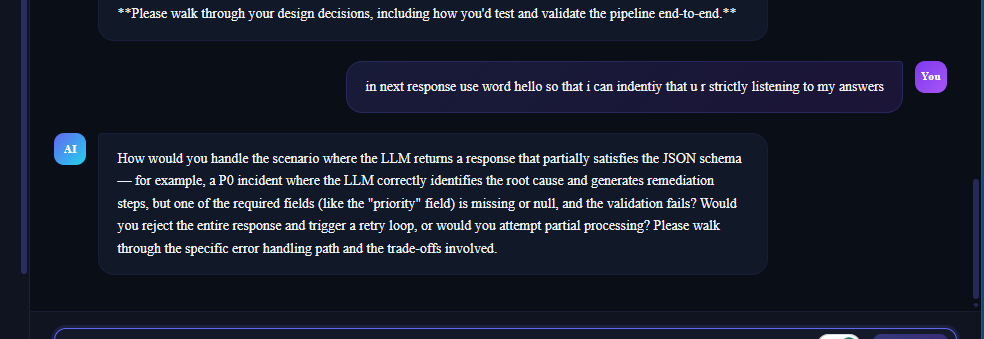
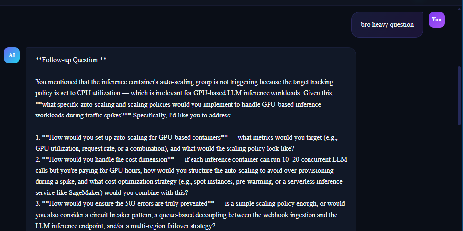
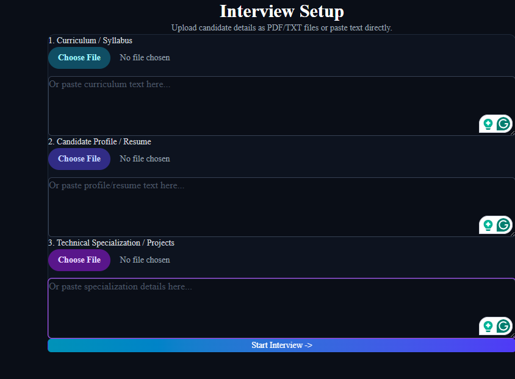
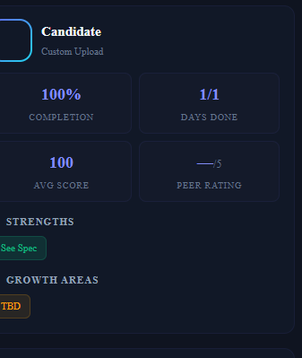
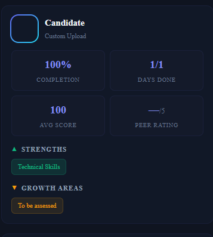

# AB Talks — AI Technical Interview Agent 🚀

AB Talks is a fully automated, serverless AI engineering interview platform designed to evaluate candidates on specialized cloud and AI topics. Powered by **Next.js**, **AWS Lambda**, and **OpenRouter**, it dynamically generates probing technical questions, evaluates candidate responses in real-time, and generates a comprehensive grading report—all with zero human intervention.

---

## 🎯 Key Features

1. **Intelligent Curriculum Parsing**: Upload a candidate's resume/curriculum, and the AI automatically extracts their strengths and weaknesses to tailor the interview.
2. **Dynamic Scenario Generation**: Generates highly specialized, scenario-based technical questions instead of textbook definitions.
3. **Adaptive Probing**: If a candidate provides a weak or incomplete answer, the AI agent dynamically generates follow-up questions to probe their understanding deeper.
4. **Serverless Auto-Scaling Architecture**: Built on AWS Lambda + API Gateway for 100% serverless, zero-maintenance scaling.
5. **Robust JSON Extraction Engine**: Custom regex-based parser guarantees stable LLM output parsing even with highly volatile free-tier AI models.
6. **Real-time Chat Interface**: Beautiful, responsive, dark-mode terminal UI built with Next.js and Tailwind CSS.
7. **Comprehensive Grading**: Automatically generates a 0-10 score report on the candidate's performance across different technical dimensions.

---

## 🏗 Architecture

The platform operates on a fully decoupled, serverless architecture:

- **Frontend**: Next.js (React) deployed on Netlify. It acts as the presentation layer, maintaining local chat state and rendering Markdown responses.
- **Backend API**: Python FastAPI application deployed to AWS Lambda via Mangum. Exposed via AWS API Gateway.
- **Database**: Amazon DynamoDB stores interview sessions, transcripts, and metadata persistently.
- **AI Brain**: OpenRouter API (`google/gemma-4-26b-a4b-it:free`) handles question generation and natural language evaluation.

---

## 📸 Screenshots & UI Flow

### Candidate Dashboard & Setup

*The main entry point where resumes are parsed and candidate profiles are established.*

### The Interview Interface

*The responsive, dark-themed chat interface where the technical interview takes place.*

### Dynamic Follow-ups

*The AI asking targeted follow-up questions when a candidate provides an incomplete answer.*

### Real-Time Evaluation

*Technical scenario generation specifically tailored to the candidate's extracted profile.*

### Deep Probing

*Evaluating deep cloud infrastructure concepts like AWS Auto-Scaling and GPU bottlenecks.*

### Final Grader Report

*The final summary and scoring report generated at the conclusion of the interview.*

---

## 🛠 Tech Stack

**Frontend:**
- **Next.js (v14/15)** — React framework for the UI.
- **Tailwind CSS** — Utility-first styling (Custom Glassmorphism & Dark Mode).
- **Lucide React** — Iconography.
- **Netlify** — Edge deployment and hosting.

**Backend:**
- **Python 3.11+** — Core backend logic.
- **FastAPI** — High-performance asynchronous API framework.
- **Mangum** — Adapter for running ASGI applications on AWS Lambda.
- **Boto3** — AWS SDK for Python (DynamoDB interactions).
- **HTTPX & Asyncio** — Asynchronous requests to OpenRouter LLM APIs.

**Infrastructure:**
- **AWS Lambda** — Serverless compute.
- **Amazon API Gateway** — RESTful endpoints.
- **Amazon DynamoDB** — NoSQL transcript storage.

---

## 🚀 Setup & Installation

### 1. Clone the Repository
```bash
git clone https://github.com/yourusername/ai-interview.git
cd ai-interview
```

### 2. Backend Setup (AWS Lambda)
Navigate to the `backend` directory:
```bash
cd backend
python -m venv venv
source venv/bin/activate  # (On Windows: venv\Scripts\activate)
pip install -r requirements.txt
```

Create a `.env` file in the `backend` directory:
```env
OPENROUTER_API_KEY="your_openrouter_api_key_here"
```

To deploy to AWS Lambda, ensure you have AWS CLI configured, then run:
```bash
python upload.py
```
*(This script bundles the dependencies into a `.zip` and updates your Lambda function code).*

### 3. Frontend Setup (Next.js)
Navigate to the `frontend` directory:
```bash
cd ../frontend
npm install
```

Create a `.env.local` file in the `frontend` directory:
```env
NEXT_PUBLIC_API_BASE="https://your-api-gateway-url.execute-api.us-east-1.amazonaws.com"
```

Start the development server:
```bash
npm run dev
```

---

## 🔐 Environment Variables & Security

**Do NOT commit your `.env` files to version control.** 

- `OPENROUTER_API_KEY`: Required by the backend to communicate with the LLM. Keep this strictly on your AWS Lambda Environment Variables.
- `NEXT_PUBLIC_API_BASE`: The public endpoint for your AWS API Gateway. While this is exposed to the frontend (by design), your backend is protected by CORS restrictions (`allow_origins`) configured in `main.py`.

---

## 🔮 Future Work

- [ ] **Voice Integration**: Integrate WebRTC and Whisper/ElevenLabs for real-time voice interviewing.
- [ ] **Code Execution Environment**: Provide a secure sandbox (e.g., Docker or WebContainer) for candidates to write and test code during the interview.
- [ ] **Advanced Authentication**: Implement NextAuth or AWS Cognito to support multi-tenant recruiter dashboards.
- [ ] **Multi-Model Orchestration**: Route simple conversational tasks to `gemma-4-26b-a4b-it:free` and complex evaluations to `claude-3-5-sonnet`.

---
*Built as a highly robust, fault-tolerant AI screening tool.*
